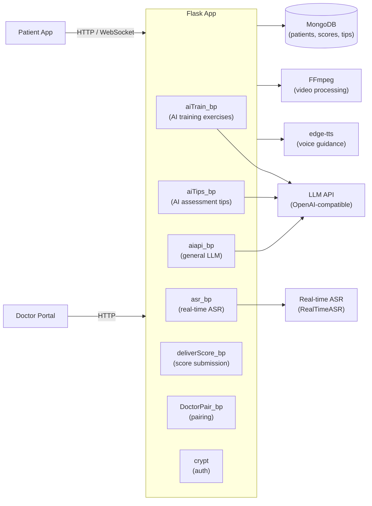

# Stroke-Training-Platform · AI Stroke Rehabilitation Full-Stack

> **Full-stack platform for stroke patient rehabilitation — Flask backend (AI exercises, real-time ASR, edge-TTS, video processing, doctor-patient pairing) + Vue 3 frontend in `frontend/`.**
>
> 脑卒中康复训练平台（前后端一体化）：Flask 后端 + Vue 3 前端 (`frontend/`)，AI 生成个性化训练题目、实时 ASR 语音识别、edge-TTS 语音引导、ffmpeg 视频处理、医患配对管理。

[English](#english) · [中文](#中文)


---

<a id="english"></a>

## Architecture



## Quickstart

```bash
# Backend
pip install -r requirement.txt
cp .env.example .env  # fill OPENAI_API_KEY, MONGODB_URI
python run.py

# Frontend (Vue 3)
cd frontend && npm install && npm run dev
```

> Note: `ffmpeg` must be installed and on PATH. On Windows the bundled `ffmpeg-master-latest-win64-gpl/` can be used.

## Key APIs

| Blueprint | Endpoint | Description |
|---|---|---|
| `aiTrain_bp` | `GET /api/aiTrain` | Generate personalized exercises from latest AI tips |
| `aiTips_bp` | `POST /api/aiTips` | Submit rehab session → AI assessment |
| `asr_bp` | `WS /api/asr` | Real-time speech recognition stream |
| `deliverScore_bp` | `POST /api/deliverScore` | Submit exercise score |
| `DoctorPair_bp` | `POST /api/pair` | Doctor-patient pairing |

## Technical Highlights

<details>
<summary><b>LLM-generated personalized rehabilitation exercises</b></summary>

- **S**: Generic rehabilitation exercises ignore individual patient deficits identified from their assessment; one-size-fits-all training is less effective.
- **A**: `aiTrain_bp` fetches the patient's latest AI-assessed tips from MongoDB, injects them into a structured system prompt that instructs the LLM (OpenAI-compatible) to generate 20 targeted exercises (multiple-choice + fill-in-the-blank) as a JSON array. Output is parsed and returned directly.
- **R**: Every training session is personalized to the patient's current deficit profile; content updates automatically as assessments evolve.
</details>

<details>
<summary><b>Real-time ASR for voice-guided rehabilitation</b></summary>

- **S**: Stroke patients often have motor impairments that make typing difficult; voice is the natural input modality for rehabilitation exercises.
- **A**: `asr_bp` exposes a streaming ASR endpoint backed by `RealTimeASR` (讯飞 / compatible engine). Speech is transcribed in real time over WebSocket, enabling voice-answering of training exercises without client-side speech processing.
- **R**: Hands-free interaction mode; patients can complete exercises verbally.
</details>

<details>
<summary><b>ASR → LLM → TTS multimodal pipeline</b></summary>

- **S**: A rehabilitation session needs to feel like interacting with a real therapist: hear a question, speak an answer, hear feedback.
- **A**: Patient voice → `asr_bp` transcribes → `aiapi_bp` sends to LLM → response text → `edge-tts` synthesizes audio → played back to patient. `ffmpeg`/`moviepy` handle audio format conversion.
- **R**: Full voice loop: speech in, speech out, zero manual typing required.
</details>

## Repo Layout

```
application/
├── aiTrain.py          LLM personalized exercise generation
├── aiTips.py           AI assessment + tips storage
├── aiapi.py            general LLM chat endpoint
├── asr_bp.py           real-time ASR (WebSocket)
├── deliverScore.py     score submission
├── DoctorPair.py       doctor-patient pairing
├── DoctorPatientInfo.py patient records
├── AIBase.py           OpenAI-compatible LLM wrapper
├── base.py             MongoDB connection
└── config.py           env-based config
run.py                  Flask entry point
```

## Roadmap

- [x] AI-generated personalized training exercises
- [x] Real-time ASR voice input
- [x] edge-TTS voice guidance
- [x] Doctor-patient pairing and score delivery
- [x] Video processing with FFmpeg
- [ ] Progress trend charts (per patient over time)
- [ ] Push notifications to doctor portal on milestone
- [ ] Offline exercise mode (cached exercises)

---

<a id="中文"></a>

## 中文速读

- **是什么**：脑卒中康复训练平台后端，Flask 蓝图架构，AI 生成个性化训练题目（LLM JSON 输出）、实时 ASR 语音识别、edge-TTS 语音引导、医患配对管理。
- **亮点**：ASR → LLM → TTS 完整语音闭环，患者语音作答无需打字；`aiTrain_bp` 将最新 AI 评估注入 prompt 生成个性化 20 题。
- **运行**：`pip install -r requirement.txt && python run.py`，需安装 ffmpeg。

## License

MIT © [Seal-Re](https://github.com/Seal-Re)
